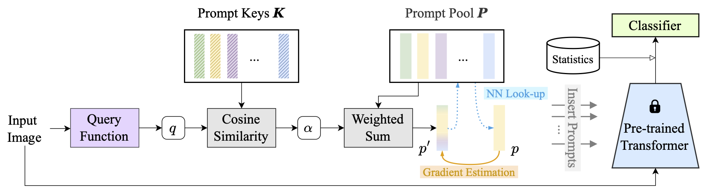

#  VQ-Prompt
Official PyTorch code for "Vector Quantization Prompting for Continual Learning (NeurIPS2024)".


<p align="center">

</p>

## Abstract
Continual learning requires to overcome catastrophic forgetting when training a single model on a sequence of tasks. Recent top-performing approaches are prompt-based methods that utilize a set of learnable parameters (\ie, prompts) to encode task knowledge, from which appropriate ones are selected to guide the fixed pre-trained model in generating features tailored to a certain task. However, existing methods rely on predicting prompt identities for prompt selection, where the identity prediction process cannot be optimized with task loss. This limitation leads to sub-optimal prompt selection and a failure to adapt pre-trained features for the specific task. Previous efforts have tried to address this by directly generating prompts from input queries instead of selecting from a set of candidates, which, however, results in continuous prompts that lack sufficient abstraction for effective task knowledge representation. To address these challenges, we propose VQ-Prompt, a prompt-based continual learning method that incorporates Vector Quantization (VQ) into end-to-end training of a set of discrete prompts. Without the need for storing past data, VQ-Prompt outperforms state-of-the-art continual learning methods across a variety of benchmarks under the challenging class-incremental setting.


## Requirements
 * python=3.8.18
 * torch=2.0.0+cu118
 * torchvision=0.15.1+cu118
 * timm=0.9.12
 * scikit-learn=1.3.2
 * numpy
 * pyaml
 * pillow
 * opencv-python
 * pandas
 * openpyxl (write results to a xlsx file)

 
## Datasets
 * Create a folder `data/`
- [CIFAR-100](https://www.cs.toronto.edu/~kriz/cifar-100-python.tar.gz)
- [Imagenet-R](https://people.eecs.berkeley.edu/~hendrycks/imagenet-r.tar)
- [CUB-200](https://data.caltech.edu/records/65de6-vp158/files/CUB_200_2011.tgz)

## Checkpoints
 * Create a folder `pretrained/`
 - [Sup-21K](https://huggingface.co/timm/vit_base_patch16_224.augreg_in21k/blob/main/pytorch_model.bin)
 - [Sup-1K](https://huggingface.co/timm/vit_base_patch16_224.augreg2_in21k_ft_in1k/blob/main/pytorch_model.bin)
 - [iBOT-1k](https://lf3-nlp-opensource.bytetos.com/obj/nlp-opensource/archive/2022/ibot/vitb_16/checkpoint_teacher.pth)
 - [DINO-1k](https://dl.fbaipublicfiles.com/dino/dino_vitbase16_pretrain/dino_vitbase16_pretrain.pth)  

## Training
Run the following commands under the project root directory. **The scripts are set up for 1 GPUs**.

```bash
sh experiments/cifar-100.sh
sh experiments/imagenet-r_all.sh
sh experiments/cub-200.sh
```

## Results
Results will be saved in a folder named `outputs/`.


## Note on setting
Our method has not been tested for other settings such as domain-incremental continual learning.


## Reference Codes
[1] [CODA-Prompt](https://github.com/GT-RIPL/CODA-Prompt)

[2] [HiDe-Prompt](https://github.com/thu-ml/HiDe-Prompt)

## Citation
If you find this repository is useful, please cite the following reference.
```
@article{jiao2024vector,
  title={Vector Quantization Prompting for Continual Learning},
  author={Jiao, Li and Lai, Qiuxia and Li, Yu and Xu, Qiang},
  journal={NeurIPS},
  year={2024}
}
```
